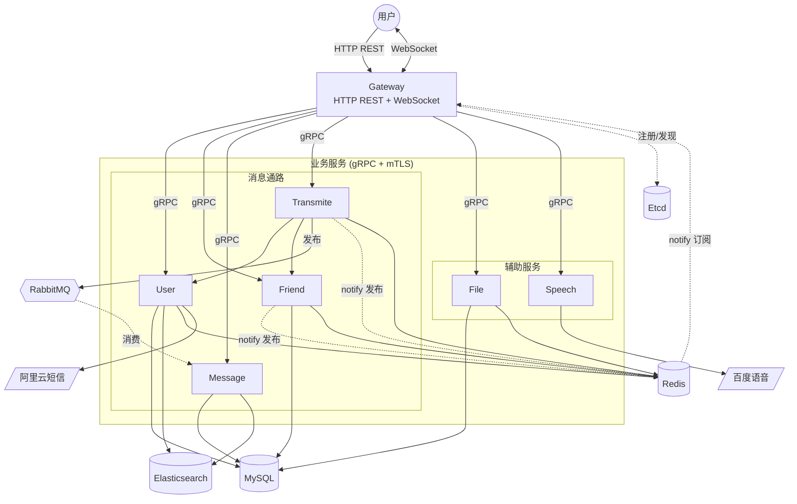

# zchat 系统架构文档

## 概述

zchat 是一个仿微信的即时通讯后端，使用 C++20 编写。系统由一个 HTTP/WebSocket 网关和七个 gRPC 微服务组成，通过 etcd 做服务发现，RabbitMQ 做消息异步持久化，Redis 同时承担会话存储、在线状态和实时通知推送三职，MySQL 持久化用户/好友/消息/文件数据，Elasticsearch 仅服务于用户与消息检索。

技术栈：Drogon（网关 HTTP/WS 层）、gRPC + mTLS（服务间同步通信）、etcd-cpp-apiv3（服务发现与租约）、AMQP-Cpp + libevent（RabbitMQ 发布订阅）、Drogon ORM（MySQL/Redis 客户端）、Elasticsearch、libsodium/OpenSSL3（加密）、Protobuf（接口契约）。

## 架构图

## 组件

| 组件 | 职责 | 技术 | 层 |
|---|---|---|---|
| Gateway | 对外 HTTP REST + WebSocket 入口，鉴权，路由请求到下游 gRPC 服务，订阅 Redis notify 推送到在线 WS 连接 | Drogon | presentation |
| User | 用户注册/登录/信息/检索，短信验证码，会话签发 | gRPC + Drogon ORM | service |
| Friend | 好友关系/会话/成员管理，好友申请通知 | gRPC + Drogon ORM | service |
| Transmite | 消息收发枢纽：校验会话与成员身份，发布消息到 RabbitMQ，向在线成员发 Redis notify | gRPC + AMQP-Cpp | service |
| Message | 消费 RabbitMQ 队列，消息落 MySQL 并建 ES 索引，提供历史消息查询 | gRPC + Drogon ORM | service |
| File | 文件上传/下载，文件元数据与二进制存 MySQL | gRPC + Drogon ORM | service |
| Speech | 语音转文字，转发百度 ASR 外部 API | gRPC | service |
| Etcd | 服务注册与发现，所有 gRPC 服务向其注册并凭其解析下游地址 | etcd-cpp-apiv3 | data |
| RabbitMQ | 消息异步持久化通道，Transmite 发布、Message 消费 | AMQP-Cpp + libevent | data |
| Redis | 会话存储、在线状态、登录失败计数、限流、Pub/Sub 实时通知 | Drogon RedisClient | data |
| MySQL | 用户、好友关系、会话成员、消息、文件元数据与内容持久化 | Drogon ORM (InnoDB) | data |
| Elasticsearch | 用户与消息全文检索索引 | — | data |
| 阿里云短信 | 注册/登录验证码下发 | 外部 SDK | external |
| 百度语音 | 语音识别 ASR | 外部 HTTP API | external |

## 交互

网关同时承载两类外部连接：HTTP REST（登录、好友、历史消息等请求-响应操作）和 WebSocket（长连接消息收发）。REST 请求经路由表分发到对应 gRPC 服务，带鉴权的路由先校验 Redis 中的会话。

发消息主干流程是系统最关键的数据通路：客户端通过 WebSocket 将消息发到 Gateway，Gateway 转发到 Transmite 服务。Transmite 先从 Redis 取会话对应的用户 ID，调 User 服务拿发送者信息，再调 Friend 服务校验发送者是否为会话成员。校验通过后，消息序列化为 Protobuf 发布到 RabbitMQ（fire-and-forget），同时向所有在线成员的 Redis notify 频道发布通知。Message 服务异步消费 RabbitMQ 队列，将消息落 MySQL 并建立 ES 索引。Gateway 订阅 `zchat:notify:*` 模式，收到通知后按频道中的用户 ID 找到对应的 WS 连接推给客户端。

服务发现由 etcd 统一承担：每个 gRPC 服务启动时通过 KeepAlive 向 etcd 注册实例并维持租约（TTL 10s），Gateway 和服务间调用方通过 EtcdDiscovery 解析下游地址，ChannelPool 缓存复用 gRPC 通道。图中 etcd 仅画 `gateway → etcd` 一条代表线，实际七个服务均向 etcd 注册并凭其解析下游。

## 数据存储

| 存储 | 类型 | 用途 | 写入方 |
|---|---|---|---|
| MySQL `user` | InnoDB | 用户基本信息（昵称、密码、手机、头像 ID） | User |
| MySQL `relation` | InnoDB | 好友关系对 | Friend |
| MySQL `friend_apply` | InnoDB | 好友申请事件 | Friend |
| MySQL `chat_session` | InnoDB | 会话元数据 | Friend |
| MySQL `chat_session_member` | InnoDB | 会话成员关系 | Friend |
| MySQL `message` | InnoDB | 消息记录（按会话+时间索引） | Message |
| MySQL `file_store` | InnoDB | 文件元数据与二进制内容（LONGBLOB） | File |
| Elasticsearch | — | 用户与消息检索索引 | User, Message |
| Redis | KV | 会话、在线状态、验证码、限流、登录失败计数、Pub/Sub notify | Gateway, User, Friend, Transmite, File |
| RabbitMQ | AMQP | 消息异步持久化队列 | Transmite 发布 / Message 消费 |
| Etcd | KV | 服务注册与发现 | 全部七个服务 |

## 关键决策

### ADR-1: 消息持久化走 RabbitMQ 异步队列而非同步写库

**状态:** Accepted

**背景:** 发消息是高频且对延迟敏感的操作，若在请求路径内同步写 MySQL + 建 ES 索引，单条消息往返会叠加多次 I/O，吞吐受限于数据库写性能。

**决策:** Transmite 将消息序列化后 fire-and-forget 发布到 RabbitMQ，由 Message 服务异步消费落库。

**理由:** 发布操作本身极快，消息队列吸收写库延迟的尖峰，使发消息往返仅含校验（User + Friend gRPC）与 MQ 发布。代价是引入最终一致性：消息落库有延迟，消费者需幂等以应对重投递。

**后果:**
- 简化：发消息路径不阻塞在数据库写，吞吐与延迟解耦于 MySQL 写性能。
- 复杂化：消费侧需处理重复消息与失败重试，历史消息查询在落库前会有短暂不可见窗口。

### ADR-2: 实时通知走 Redis Pub/Sub 而非长轮询或 MQ

**状态:** Accepted

**背景:** 在线用户需即时收到新消息/好友申请等通知。网关已持有 WebSocket 连接，需要一个低延迟通道把服务端事件推到正确的网关实例。

**决策:** 服务端事件发布到 `zchat:notify:{user_id}` 频道，Gateway 订阅 `zchat:notify:*` 模式匹配，按用户 ID 路由到对应 WS 连接。

**理由:** Redis 已在系统中承担会话与缓存，复用其 Pub/Sub 不引入新组件；模式订阅让任意 Gateway 实例都能收到发给其在线用户的通知，天然支持网关多实例水平扩展。

**后果:**
- 简化：通知通道与会话存储共用 Redis，无新增依赖；网关多实例扩展无需额外协调。
- 复杂化：Pub/Sub 是 fire-and-forget，用户离线时发出的通知会丢失，需结合在线状态判断是否推送，离线消息靠客户端拉取历史补偿。

### ADR-3: 服务间同步通信用 gRPC + mTLS，服务发现用 etcd

**状态:** Accepted

**背景:** 七个服务需要相互调用，既要强类型接口契约，又要能在多实例部署下动态寻址，且服务间流量需加密与双向认证。

**决策:** Protobuf 定义全部服务接口，gRPC 同步调用，通过 etcd 注册实例并解析下游地址，ChannelPool 复用连接，mTLS 双向证书认证。

**理由:** Protobuf 提供编译期接口保证；etcd 的租约 + Watch 机制天然适合实例动态上下线；mTLS 在零信任内网下防止未授权服务接入。复用 gRPC 已是该栈的成熟选择，无需自研序列化或服务发现。

**后果:**
- 简化：接口契约集中、类型安全；实例扩缩容靠 etcd 自动生效，无需改配置。
- 复杂化：证书签发与轮换需运维流程（已有 `generate_tls_certs.sh`）；etcd 成为服务发现的单点，其可用性影响全局寻址。

## 约束与权衡

- **Transmite 不落库**：消息经 RabbitMQ 由 Message 异步持久化，Transmite 重启不丢已发布消息（MQ 持久化），但发送成功不等于落库成功。
- **Elasticsearch 范围有限**：仅 User 和 Message 接 ES，其余服务检索走 MySQL。
- **文件存 MySQL LONGBLOB**：未用对象存储，大文件场景下 MySQL 会成为瓶颈，迁移到 S3/OSS 是已知的升级路径。
- **Redis Pub/Sub 不持久**：离线用户的通知丢失，靠客户端重连后拉取历史消息补偿。
- **etcd 租约 TTL 10s**：实例宕机后最长 10s 内服务发现仍可能返回旧地址，调用方需处理连接失败并重试。
- **gRPC 调用方带 5s deadline**：`ServiceClients::kGrpcDeadline`，文件类操作放宽至 30s。

## 箭头语义

- **实线 `-->`**：请求-响应，调用方依赖对方返回才能继续（协程挂起等待，不阻塞线程，但语义上要等结果）。例：Gateway 发 gRPC、SQL 查 MySQL。
- **虚线 `-.->`**：fire-and-forget，发完不等对方处理。例：RabbitMQ 投递、Redis Pub/Sub、etcd 租约心跳。
- **双向 `<-->`**：仅当两边都主动调用对方。例：`user <--> gw`（WebSocket 全双工）。
